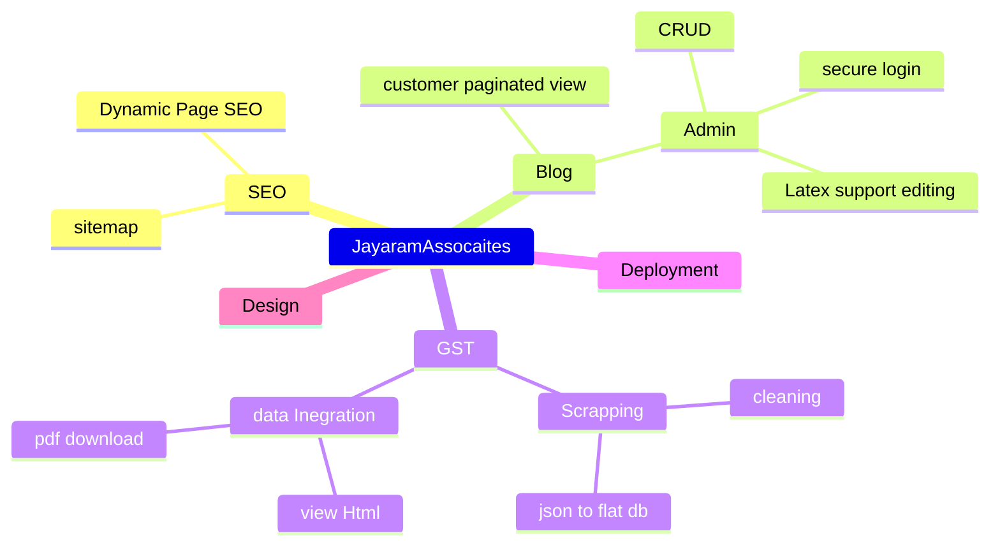

# JAS-WEB-Laravel-Docs

A brief description and analysis that went into building the site jayaramassociates.com

Followed Build Process 

## To build 

## Scrapping

>In this World's wide waters we the scrappers are the fishermen, casting our nets and to hope catch a whale , but often forget the tide it brings 

So the application i built needed to serve as a income tax update from a the government website. 

