# JAS-WEB-Laravel-Docs

A brief description and analysis that went into building the site jayaramassociates.com

Followed Build Process 

## To build 

A dynamic modern website that garners attention and addes value for the targeted demografic viewer's time.

## Scrapping

>In this World's wide waters we the scrappers are the fishermen, casting our nets and to hope catch a whale , but often forget the tide it brings 

We need tons of indian GST information acts,rules,notification,circulars,and forms as they are released and to be accessible to the end use in our website, as a knowledge base.

So adhering to the robots.txt file from the source websites

## Blog

>Made by Web Artisan for Web Artisans
>   -laravel

the beauty of MVC architecture crafted to perfection by the simplicity of laravel, writeen in php. I was convinced that this frame work is the go to.

```mermaid
graph 
    User("😁 User")--no login view-->blog(blog)
    Admin("🐱‍👤 Admin")--secured crud-->blog
```

for login and user session tracking , no worried laravel doe it all for you inbuilt in controller in